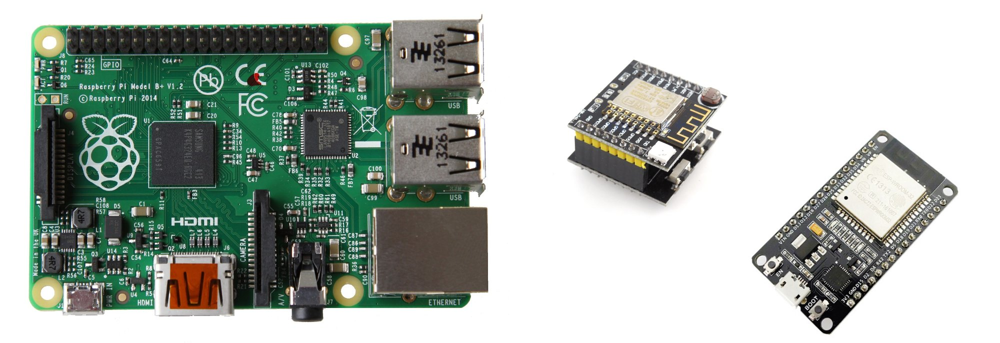
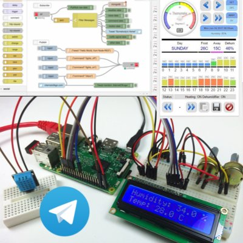
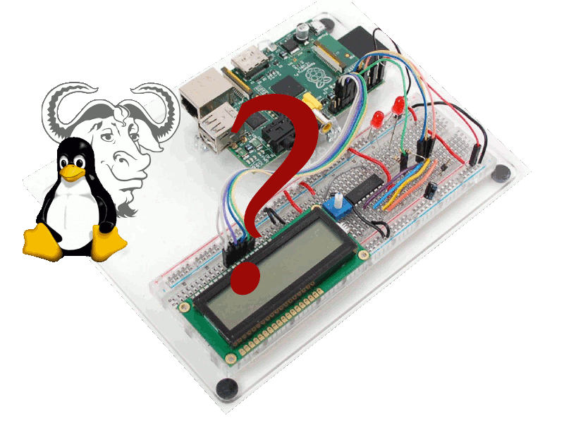

## Programma del Workshop

Introduzione all'IoT con Node-RED <!-- .element: class="fragment" -->

Utilizzo del RaspberryPI e altre SBC per creare IoT  <!-- .element: class="fragment" -->

Collegamento a moduli remoti WiFi (ESP8266/ESP32) <!-- .element: class="fragment" -->

  <!-- .element: class="fragment" -->

Il più possibile interattivo e ricco di domande e scambi di idee.....<!-- .element: class="fragment" -->

__non siate timidi!!!!__<!-- .element: class="fragment" -->

<--s-->
<!-- .slide: class="two-floating-elements" -->
## Il nostro obiettivo

* realizzare una centralina ambientale (temperatura/umidità/luminosità)  <!-- .element: class="fragment" -->
* Collegamento di sensori remoti wifi (ESP 8266) <!-- .element: class="fragment" -->
* Controllo relè e pulsanti   <!-- .element: class="fragment" -->
* Dashboard di visualizzazione e controllo via web browser <!-- .element: class="fragment" -->
* Uso di Telegram Bot per telecontrollo <!-- .element: class="fragment" -->

..... zero code ! <!-- .element: class="fragment" -->

<--s-->

## Da quale livello partiamo ?

